 

**Transformando ideias em aplicações, integrações e experiências digitais.**

## 👋 Sobre mim

Sou **Thiago Soares Rocha**, desenvolvedor de aplicações **web e mobile** e estudante de Informática. Gosto de unir interfaces bem construídas a soluções de back-end, bancos de dados e automações que resolvem problemas reais.

Trabalho principalmente com **TypeScript, JavaScript, React, Next.js e PHP**, além de **Node.js/Express**, **React Native** e serviços como **Supabase** e **Firebase**. Em Python, desenvolvo scripts, integrações e rotinas de automação com **Selenium**.

Tenho interesse especial em **arquitetura de software, APIs, ferramentas para desenvolvedores e inteligência artificial**. Valorizo código organizado, componentes reutilizáveis, segurança e uma boa experiência de uso.

> 📍 Belo Horizonte, MG · 🎓 Técnico em Informática · 🧠 Estudando e construindo projetos continuamente

## 🧰 Tecnologias e ferramentas

**Front-end e interfaces**

  

**Back-end, automação e integrações**

  

**Dados, autenticação e serviços**

  

**Ferramentas, design e desenvolvimento de jogos**

  

Também utilizo **React Native**, **NativeWind**, **REST APIs**, **SQL**, **GitHub Actions** e ferramentas do ecossistema de IA.

## 🚀 Projetos públicos em destaque

<table>
  <tr>
    <td width="50%" valign="top">
      <h3><a href="https://github.com/Thiago1428/AI-plan-generator">🧠 EduIA Generator</a></h3>
      
Aplicação que utiliza Google Gemini para criar planos de estudo personalizados para ENEM e vestibulares, com exportação em PDF.

      
<code>PHP</code> <code>JavaScript</code> <code>Tailwind CSS</code> <code>Gemini API</code>

    </td>
    <td width="50%" valign="top">
      <h3><a href="https://github.com/Thiago1428/Login-and-Calendar-Dynamic">📅 Login & Calendar</a></h3>
      
Calendário interativo com autenticação Firebase e recursos de criação, edição e exclusão de eventos.

      
<code>JavaScript</code> <code>Firebase Auth</code> <code>HTML</code> <code>CSS</code>

    </td>
  </tr>
  <tr>
    <td colspan="2" valign="top">
      <h3><a href="https://github.com/Thiago1428/Butchery-stock-control">📦 Butchery Stock Control</a></h3>
      
Repositório público de um projeto de controle de estoque.

    </td>
  </tr>
</table>

  <a href="https://github.com/Thiago1428?tab=repositories"><strong>Ver todos os repositórios →</strong></a>

## 🐍 Minhas contribuições em movimento

  
A cobrinha percorre meu histórico de contribuições. O SVG é regenerado diariamente pelo GitHub Actions.

  <picture>
    <source media="(prefers-color-scheme: dark)" srcset="https://raw.githubusercontent.com/Thiago1428/Thiago1428/output/github-contribution-grid-snake-dark.svg" />
    <source media="(prefers-color-scheme: light)" srcset="https://raw.githubusercontent.com/Thiago1428/Thiago1428/output/github-contribution-grid-snake.svg" />
    
  </picture>

Os arquivos animados são publicados na branch <code>output</code> quando o workflow <a href="https://github.com/Thiago1428/Thiago1428/actions/workflows/snake.yml">Snake contributions</a> é executado pela primeira vez.

## ⚡ No que estou focado

- **Desenvolvimento full-stack:** aplicações modernas, dashboards, APIs e integrações.
- **Automação e IA:** fluxos inteligentes, ferramentas para produtividade e agentes.
- **Engenharia de software:** arquitetura modular, boas práticas e manutenção de longo prazo.

---

  Feito no GitHub, com código, curiosidade e vontade de aprender. ✨

